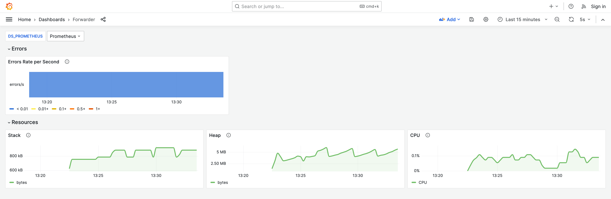
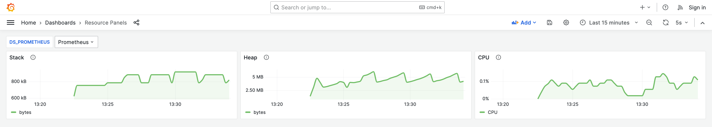
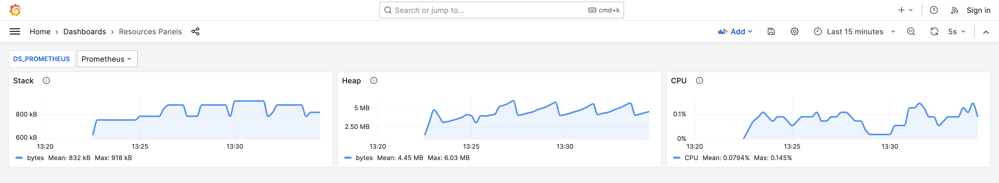
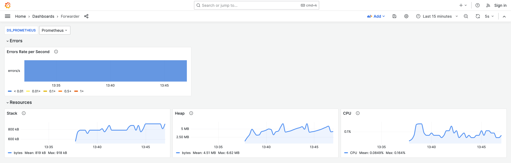

# Dashboard-Fusion Example

The following example demonstrates common use case of Dashboard Fusion.

Let's say there are panels that are shared between multiple dashboards.
They present a common set of metrics, e.g. resources usage.
We want to have an easy way to update these panels across all dashboards, while preserving the dashboard layout.

## Compose

In order to run the example, we provide docker-compose for effortless setup of Grafana, Prometheus, and [Forwarder](https://github.com/saucelabs/forwarder) - the service we want to monitor.

### Preqrequisites

- [Makefile](https://www.gnu.org/software/make/manual/make.html) installed on your system
- [Docker](https://www.docker.com/) installed on your system
- [Docker Compose](https://docs.docker.com/compose/) installed on your system

### Starting and Stopping

Use the following commands to start and stop containers:
- Start containers:
     ```bash
     make up
     ```
- Stop containers:
  ```bash
  make down
  ```

Once the containers are up and running, Grafana Dashboards will be available at http://localhost:3000/dashboards.

## Example
1. We want to monitor some Service and its resources' usage. Resources panels are common for all services, so we want to share them between dashboards.

    The example contains:
    - `resource-dashboard.json` resources usage - this one is shared 
    - `example-dashboard.json` resources and custom panels - extends resource panels
    - `resource-dashboard-updated.json` - updated resource dashboards
    - `resource-panels-updated.json` - updated resource panels

1. Run [monitoring compose](#compose) and open Grafana Dashboards at http://localhost:3000/dashboards.
    You will see the following dashboards:
    - Dashboard with resource usage and custom panels:
        
    - Dashboard with resources - these panels will be shared:
      
    - Dashboard with resources - already updated:
      

1. In order to update the panels in the dashboard, we run Dashboard Fusion:
    ```bash
    dashboard-fusion --dash example-dashboard.json --panels resource-panels-updated.json --out example-dashboard.json
    ```
    and we get the following result:
    

    The dashboard layout is preserved, while the panels are updated with the new content.

1. Restart [monitoring compose](#compose) to see the updated dashboard.